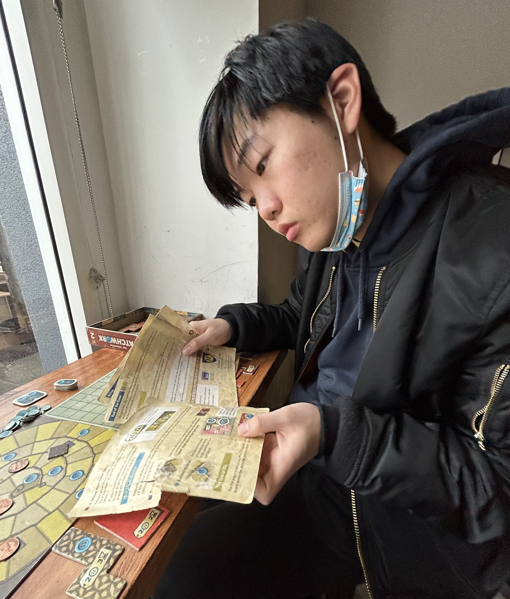

# David Choi {#top}


## About me
Hi my name is David Choi. I'm a **Computer Science** major studying at the **University of California San Diego** and previously at the **University of California Merced**.

My current research interests are in Computer Graphics, specifically **stylized shaders** and **differentiable rendering**. I currently am advised by [Tzu Mao Li](https://cseweb.ucsd.edu/~tzli/) and [Ravi Ramamoorthi](https://cseweb.ucsd.edu/~ravir/) through the [ERSP program](https://sites.google.com/ucsd.edu/ersp/home). 

```
public static void main(String args[]) {
    System.out.println("My favorite programming language is Java, even though it's trash");
}
```

Outside of Comp Sci, I enjoy playing board games, climbing, and watching competitive Valorant.  My favorite teams are:
1. DRX
2. Team Secret
3. PRX

## My Education
- **University of California San Diego** | 2023 – 2025
  - *B.S. Computer Science and Engineering*
- **University of California Merced** | 2021 – 2023
  - *B.S. Computer Science*

## My Work
- *(Incoming)* **Microsoft** | 2024
  - *Software Engineering Intern*
- **Evernote** | 2021
  - *Software Engineering Intern*

## TODO for the page

- [x] Headings
- [x] Styling text
- [x] Quoting text
- [x] Quoting code
- [x] External Links
- [x] Section links
- [x] Relative links (Link to another .md file or an image in your repo. If linking to an image, encode it as a regular link rather than an image.)
- [x] Ordered and Unordered Lists
- [x] Task lists
- [ ] Unfinished task


## My favorite quote
>I am cringe. But I am free.

## Homework
- [Homework 1 Page](hw1.md)

[Jump to top](#top)